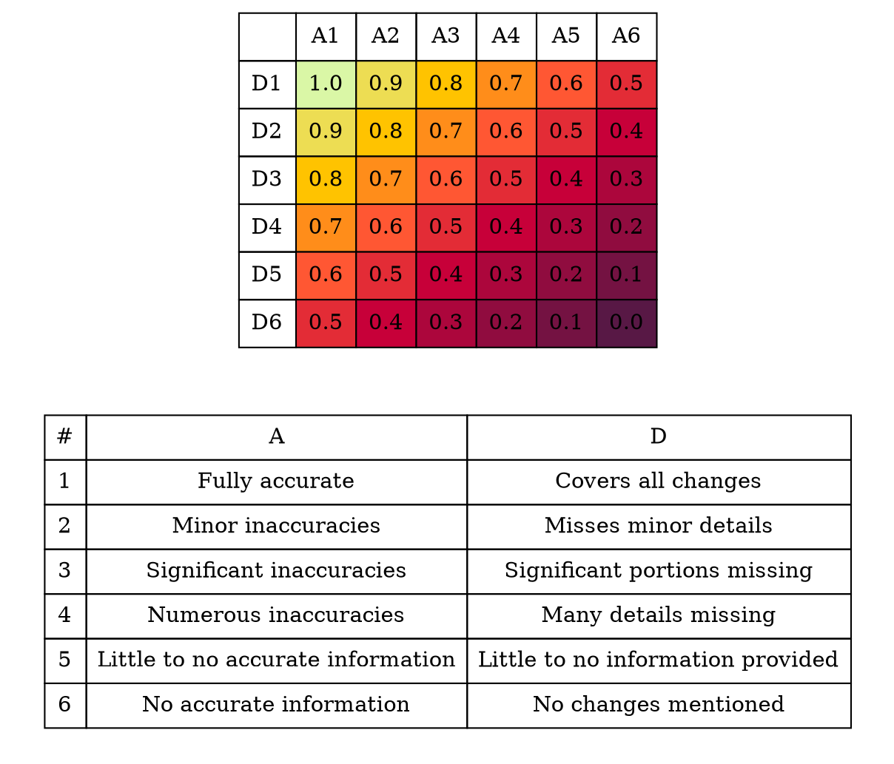

# Theory

## Conventional Commits

Conventional Commits is a specification for structuring commit messages in a consistent and easily understood manner.
The specification aims to improve the communication between team members, simplify the process of generating release notes, and streamline version management.

A conventional commit message has a rigid structure, which includes a type, an optional scope, a subject, and optional body and footer elements.
The type is a short descriptor of the change, such as `feat` for a new feature or `fix` for a bug fix.
Other common types include `refactor`, `docs`, `test`, and `chore`.
The scope is an optional noun that specifies the part of the codebase affected by the change, enclosed in parentheses.

The subject is a concise description of the change, written in the present tense.
The body and footer elements are optional and provide additional context or information about the commit, such as further explanations or issue references.
If the commit represents a breaking change, it must be marked with an exclamation mark at the end of the type, or include a footer element with the text `BREAKING CHANGE: <explanation>`.
[@ConventionalCommits]

By adhering to the Conventional Commits specification, development teams can maintain a clear and informative version control history.
This is not only beneficial to the collaboration and communication but also allows for the automation of tasks such as generating release notes or determining the next semantic version number.
In the context of `turbocommit`, the goal is to generate commit messages that meet these criteria while accurately reflecting the changes made in the git diff.

An example of a conventional commit message is shown below:

```text [fs=9 ln=false]
feat(backend): add new endpoint for registration

The endpoint accepts a POST request with a JSON
body containing the users email and password.
```

## Git and Git Diffs

Git is a distributed version control system, widely used in software development for tracking changes in codebases and facilitating collaboration among developers.
It enables developers to create branches, manage versions, and merge changes efficiently while maintaining the integrity of the codebase.

Git diffs are an integral part of the git workflow, as they provide a human and machine readble representation of the differences between two sets of code, most often between the working directory and the staged or committed changes.
Diffs display the lines of code that have been added, modified, or deleted and can be generated using the `git diff` command.

In the context of `turbocommit`, git diffs serve as the primary context for generating conventional commit messages.
By analyzing the differences in code, `turbocommit` can determine the nature of the changes and use this information to create a commit message that accurately reflects the modifications made to the repository.

## GPT-3.5 Turbo Language Model

Large language models, such as the GPT-3 family developed by leading AI research organization OpenAI, are a type of artificial intelligence (AI) model falling under the broader category of neural networks.
These networks mimic the human brain's information processing, learning from extensive data to recognize patterns and make predictions.
Specifically designed to understand and generate human-like text, large language models are trained on vast amounts of text from diverse sources, enabling them to learn language patterns, grammar, and context, which allows for a more accurate understanding and generation of text.
[@brownLanguageModelsAre2020] 

The core architecture behind large language models like `gpt-3.5-turbo` is the Transformer.
[@vaswaniAttentionAllYou2017]
The Transformer architecture has become the foundation for most state-of-the-art natural language processing (NLP) models.
Its key innovation is the self-attention mechanism, which allows the model to weigh the importance of different tokens in a given context.
This mechanism, combined with the model's ability to process input in parallel, has led to significant advancements in NLP tasks.

Tokens are the basic units of text processed by language models.
They can represent single characters, words, or subwords, depending on the language and tokenization method used.
Tokenization is the process of breaking down text into these smaller units, which allows language models to analyze and manipulate text more effectively.
In essence, tokens enable the models to learn and understand the underlying structure and relationships between various textual elements, insteaf of only learning existing words and how they are used in a given context.

Training a large language model involves a two-step process: pre-training and fine-tuning.
In the pre-training phase, models are trained on a massive dataset, typically containing billions of tokens from diverse sources, such as books, articles, and websites.
This unsupervised learning allows the model to acquire a general understanding of language, grammar, and context.
The fine-tuning phase involves training the model on a smaller, more specific dataset to adapt it to a particular task or domain.

Despite their impressive capabilities, large language models are not without limitations.
They require substantial computational resources for training and deployment, raising concerns about energy consumption and accessibility.
Additionally, these models can be prone to bias and what is called 'hallucinations', where it makes reasoning errors or creates facts.
Researchers and practitioners must address these challenges to ensure the responsible and ethical use of large language models in various applications.

## Requirements for `turbocommit`

One of the primary requirements for `turbocommit` is its ability to generate commit messages that adhere to the Conventional Commits specification.
Ensuring consistency in the commit history is essential, as it makes the codebase more informative and accessible for developers while enabling automated tasks such as generating release notes and determining semantic versioning.

Integration with the git workflow is also crucial for `turbocommit`.
Allowing the tool to work seamlessly alongside git commands and be easily accessible from the command line is important, as it caters to the lowest common denominator of developers' working environments.

Accurate reflection of the changes made in the git diff is another key requirement.
Ensuring that `turbocommit` generates commit messages that not only comply with the Conventional Commits specification but also accurately represent the modifications made to the codebase is vital, as it provides developers with a clear and informative commit history.

Efficiency and performance, along with cost-effectiveness, are important factors for `turbocommit`.
Enabling the tool to utilize the GPT-3.5 Turbo model effectively is necessary, as it delivers fast response times and cost-effective usage, ensuring that developers can generate commit messages quickly without incurring excessive operational costs.

Finally, a user-friendly interface is essential for `turbocommit`.
Making the command-line interface intuitive and providing users with clear instructions and options to customize the commit message generation process is important, as it makes it easy for developers to adopt and integrate into their existing workflows.

## Evaluation Metrics

In order to evaluate a commit message, a set of evaluation metrics will be employed, each providing a score between 0 and 1.
A higher score indicates better performance in that particular metric.
These metrics assess various aspects of the message, such as adherence to the specification, readability, and accuracy of the described change.
To obtain an overall evaluation score, the individual scores for each metric will be combined with equal weighting.
By combining these scores, the final evaluation score will also range between 0 and 1, with a higher score signifying a better commit.
With such a scoring system, it is possible to compare commits written by a person and those generated by `turbocommit`.

### Adherence to Conventional Commits Specification

To assess this, a Conventional Commit parser is used, which validates the structure and syntax of the generated commit messages.
This parser examines elements such as the type, scope, and subject of the commit message to ensure that they conform to the established guidelines.
In this evaluation metric, the adherence to the spec is measured as a binary score (0 or 1), where a score of 1 indicates full compliance with the specification, and a score of 0 represents non-compliance.

### Readability

To assess the readability of commit messages, two aspects will be evaluated: the title and the body.

For evaluating the title, we will use Natural Language Processing (NLP) techniques, specifically Part-of-Speech (POS) tagging [@honnibalSpaCyIndustrialstrengthNatural2020].
POS tagging helps us identify the grammatical structure of the title and determine if it is a proper sentence written in the present tense.
If the title is detected to be a correct sentence and written in the present tense, it will be assigned a score of 1, otherwise it will be assigned a score of 0.

For the body of the commit message, the Flesch Reading Ease Score (FRES) [@fleschHowWritePlain2016] is used, to measure the readability of the text.
FRES is a widely used readability metric that assesses the complexity of the text based on the number of words, sentences, and syllables.
The score ranges from 0 to 100, with higher scores indicating greater readability.

Since our goal is to have commit messages that are easy to read, we will normalize the FRE scores to a range between 0 and 1.
We will set a target FRES of 65 as the upper limit, considering it to be easy enough to read for our purpose.
To normalize the FRE scores, any score of 65 or above will be assigned a value of 1, while a score of 0 will remain 0.
Scores in between will be linearly interpolated within the 0 to 1 range.

To calculate the overall readability score, both the title and body scores will be combined with equal weight.
If a commit message does not have a body, only the title score will be used for the overall readability score.

### Accuracy

Evaluating the accuracy of commit messages is the most challenging aspect of this assessment.
Since there is no straightforward automated method to measure the accuracy, it will be done manually using a 2D grid rubric.



To ensure a fair comparison between human-written and generated commit messages, the evaluation process will be carried out right after studying the changes in the code.
Both types of commit messages will be scored consecutively, maintaining consistency and minimizing bias in the assessment.
This approach will help in providing a reliable measure of the accuracy of the described changes within the commit messages.


